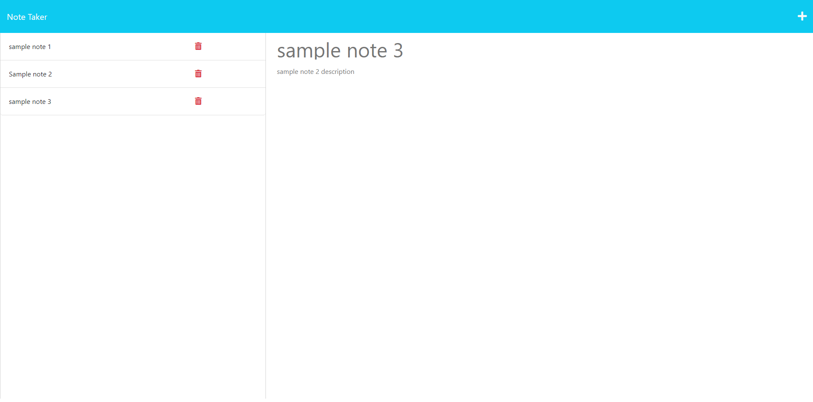

# Note Taker

## Description

The goal of this project is to build a note taking application based on a user story provided on UW bootcamp Module 11 chalenge. Full content of user story and acceptance criteria is listed under github issue#1 of this repasatory.
The application will have a header which contains title on left sede and add note and save note icons on the right side. The body have left aside and right sections where saved notes will be listed on left side and the right side will will be used to add new notes and view existing notes by clicking links on left side.

## Usage

When note taker page is loaded using url https://simple-note-tracker.onrender.com , you will be presented with a landing page with a link to a notes page. When the link on notes page is clicked a page with existing note's title/delete icon listed in the left column, and empty fields to enter a new note and view existing note by clicking links on left side.When new note title and notes are entered a seve icon will apeare at top right corner of the note page. When save button is clicked , the new note will be saved and apeare in the left column. When existing note's link is clicked from left column then the not will apear on left column for viewing. When a write icone at right side on navigation , you will be presented with an empity fields at left column to enter new note title and the note's text. Cleacking delet icon of each saved notes from left column will delete each note permanently.

## Credits
I used resorces in UW bootcamp modules and mini-project examples.

## License
MIT License

Copyright (c) 2022 GET

Permission is hereby granted, free of charge, to any person obtaining a copy
of this software and associated documentation files (the "Software"), to deal
in the Software without restriction, including without limitation the rights
to use, copy, modify, merge, publish, distribute, sublicense, and/or sell
copies of the Software, and to permit persons to whom the Software is
furnished to do so, subject to the following conditions:

The above copyright notice and this permission notice shall be included in all
copies or substantial portions of the Software.

THE SOFTWARE IS PROVIDED "AS IS", WITHOUT WARRANTY OF ANY KIND, EXPRESS OR
IMPLIED, INCLUDING BUT NOT LIMITED TO THE WARRANTIES OF MERCHANTABILITY,
FITNESS FOR A PARTICULAR PURPOSE AND NONINFRINGEMENT. IN NO EVENT SHALL THE
AUTHORS OR COPYRIGHT HOLDERS BE LIABLE FOR ANY CLAIM, DAMAGES OR OTHER
LIABILITY, WHETHER IN AN ACTION OF CONTRACT, TORT OR OTHERWISE, ARISING FROM,
OUT OF OR IN CONNECTION WITH THE SOFTWARE OR THE USE OR OTHER DEALINGS IN THE
SOFTWARE.
